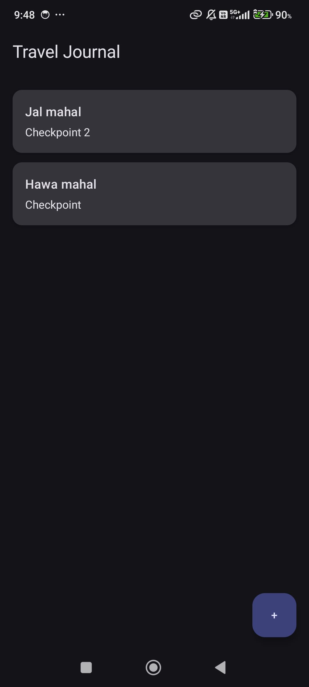
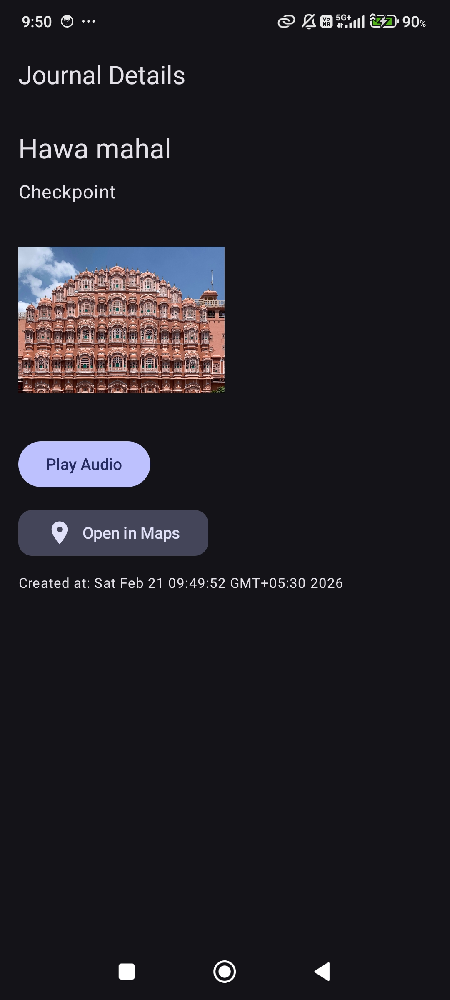

# 🌍 Travel Journal App

A modern **Offline-First Travel Journal Android App** built using **Kotlin + Jetpack Compose + MVVM + Room**.

Users can create travel entries with:
- 📝 Title & Description
- 🖼️ Multiple Images
- 🎙️ Audio Recording (Start / Pause / Resume / Stop)
- ▶️ Built-in Audio Player (Play / Pause / Seek)
- 📍 Location (Latitude & Longitude)
- 🗑️ Edit & Delete Journals

---

## Screenshots

## 🚀 Tech Stack

| Layer | Technology |
|--------|------------|
| Language | Kotlin |
| UI | Jetpack Compose |
| Architecture | MVVM |
| Database | Room |
| Async | Coroutines + Flow |
| Media | MediaRecorder + MediaPlayer |
| Image Loading | Coil |
| Location | Fused Location Provider |

---

## 🏗️ Architecture

The app follows **MVVM Architecture**:
